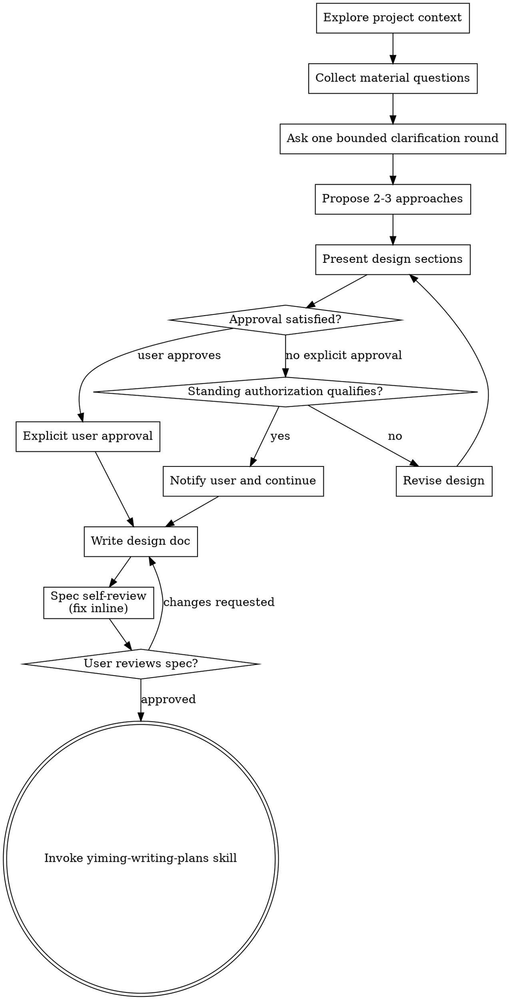

# Brainstorming Ideas Into Designs

Help turn ideas into fully formed designs and specs through natural collaborative dialogue.

Start by understanding the current project context, then collect the currently identifiable material questions into one bounded clarification round. Once you understand what you're building, present the design and satisfy the approval requirement through either explicit user approval or the user's documented standing authorization.

<HARD-GATE>
Do NOT invoke any implementation skill, write any code, scaffold any project, or take any implementation action until you have presented a design and one of the following is true:

1. The user has explicitly approved the design.
2. The design qualifies for the user's documented standing authorization, the agent has reviewed it for reasonableness, and the agent has notified the user that standing authorization is being applied.

This applies to EVERY project regardless of perceived simplicity.
</HARD-GATE>

## Anti-Pattern: "This Is Too Simple To Need A Design"

Every project goes through this process. A todo list, a single-function utility, a config change — all of them. "Simple" projects are where unexamined assumptions cause the most wasted work. The design can be short (a few sentences for truly simple projects), but you MUST present it and satisfy the approval requirement.

## Checklist

You MUST create a task for each of these items and complete them in order:

1. **Explore project context** — check files, docs, recent commits
2. **Offer the visual companion just-in-time** — NOT upfront. The first time a question would genuinely be clearer shown than described, offer it then (its own message); on approval its browser tab opens for you. If no visual question ever arises, never offer it. See the Visual Companion section below.
3. **Ask clarifying questions** — collect all currently identifiable material questions and ask them together in one concise round. Normally ask 1–3 related questions, and no more than 5 for a genuinely complex task. Ask a follow-up only when the answers reveal a new material dependency that could not reasonably have been identified earlier.
4. **Propose 2–3 approaches** — with trade-offs and your recommendation
5. **Present design** — in sections scaled to their complexity. After each section, obtain explicit user approval or apply the user's standing authorization when the section qualifies. Notify the user whenever standing authorization is applied.
6. **Write design doc** — save to `docs/superpowers/specs/YYYY-MM-DD-<topic>-design.md` and commit
7. **Spec self-review** — quick inline check for placeholders, contradictions, ambiguity, scope (see below)
8. **User reviews written spec** — ask user to review the spec file before proceeding
9. **Transition to implementation** — invoke yiming-writing-plans skill to create implementation plan

## Process Flow

**The terminal state is invoking yiming-writing-plans.** Do NOT invoke frontend-design, mcp-builder, or any other implementation skill. The ONLY skill you invoke after brainstorming is yiming-writing-plans.

## The Process

### Understanding the Idea

- Check out the current project state first: files, docs, and recent commits.
- Before asking detailed questions, assess scope. If the request describes multiple independent subsystems, flag this immediately. Do not spend questions refining details of a project that needs to be decomposed first.
- If the project is too large for a single spec, help the user decompose it into subprojects: identify the independent pieces, how they relate, and the order in which they should be built. Then brainstorm the first subproject through the normal design flow. Each subproject gets its own spec → plan → implementation cycle.
- Before asking the user, inspect all available context and collect only questions whose answers would materially affect purpose, scope, constraints, safety, or success criteria.
- Ask all currently identifiable related questions in one concise message.
- Normally ask 1–3 questions. Use up to 5 only when the task is genuinely complex.
- Prefer multiple-choice questions when the available choices are real and mutually exclusive. Otherwise ask a concise open-ended question.
- Do not split a known set of related questions across multiple turns.
- Ask a follow-up only when an answer introduces a new material dependency that could not reasonably have been identified before the first clarification round.
- If a safe and reversible default is available, state the assumption and continue instead of blocking.
- Focus on understanding purpose, constraints, and success criteria.

### Exploring Approaches

- Propose 2–3 different approaches with trade-offs.
- Present options conversationally with your recommendation and reasoning.
- Lead with your recommended option and explain why.
- YAGNI ruthlessly: remove unnecessary features from every approach and design.

### Presenting the Design

- Once you believe you understand what you're building, present the design.
- Scale each section to its complexity: a few sentences if straightforward, up to 200–300 words if nuanced.
- After each section, determine whether explicit approval is required or the section qualifies for the user's standing authorization.
- When standing authorization applies, notify the user that it is being applied, briefly explain why, and continue without waiting for another response.
- When standing authorization does not apply, explain the material decision or risk and ask for explicit approval.
- Cover architecture, components, data flow, error handling, and testing.
- Be ready to go back and clarify if something does not make sense.

## Standing Authorization

The user grants standing authorization for the agent to approve and continue with a design section when all of the following are true:

- The section remains within the user's explicitly requested outcome and scope.
- It follows previously stated preferences or an already approved direction.
- It does not introduce a materially different architecture, workflow, or deliverable.
- It is local, reversible, and does not create significant external impact.
- It does not involve destructive actions, credentials, external communications, financial or legal commitments, privacy-sensitive disclosure, or production-system writes.
- The available evidence supports a reasonable decision.
- The agent has reviewed the section for internal consistency, ambiguity, scope, and unnecessary complexity.

When applying standing authorization, notify the user in commentary before continuing. Use concise wording such as:

> Standing authorization applied: this section remains within the approved scope, is reversible, and introduces no new material risk. I am continuing with the next step.

The notification is informational and does not require the user to respond.

Do not claim that the user personally reviewed or explicitly approved details they have not seen. State that standing authorization was applied.

Standing authorization does not expand the original request. It applies only within the user's defined outcome and scope.

Request explicit user approval when any of the following is true:

- The design materially expands or changes scope.
- Two or more approaches have materially different business consequences.
- The design introduces a materially different architecture, workflow, or deliverable.
- The change is difficult to reverse.
- The action affects an external party or production system.
- The action requires a destructive, credential, privacy, financial, or legal decision.
- Available evidence does not support a reasonable default.
- The user previously reserved the decision for personal review.
- A higher-priority instruction or platform rule requires explicit user approval.

Standing authorization applies to design-section approval. It does not automatically replace a separate written-spec review gate unless that gate is explicitly revised elsewhere in this Skill.

## Design for Isolation and Clarity

- Break the system into smaller units that each have one clear purpose, communicate through well-defined interfaces, and can be understood and tested independently.
- For each unit, you should be able to answer: what does it do, how do you use it, and what does it depend on?
- Can someone understand what a unit does without reading its internals?
- Can you change the internals without breaking consumers?
- If not, the boundaries need work.
- Smaller, well-bounded units are also easier to work with. When a file grows large, that is often a signal that it is doing too much.

## Working in Existing Codebases

- Explore the current structure before proposing changes.
- Follow existing patterns.
- Where existing code has problems that affect the work, include targeted improvements as part of the design.
- Do not propose unrelated refactoring.
- Stay focused on what serves the current goal.

## After the Design

### Documentation

- Write the validated design spec to `docs/superpowers/specs/YYYY-MM-DD-<topic>-design.md`.
  - User preferences for spec location override this default.
- Use `elements-of-style:writing-clearly-and-concisely` if available.
- Commit the design document to Git.

### Spec Self-Review

After writing the spec document, look at it with fresh eyes:

1. **Placeholder scan:** Are there any incomplete sections, placeholders, or vague requirements? Fix them.
2. **Internal consistency:** Do any sections contradict each other? Does the architecture match the feature descriptions?
3. **Scope check:** Is this focused enough for a single implementation plan, or does it need decomposition?
4. **Ambiguity check:** Could any requirement be interpreted in two materially different ways? If so, choose one and make it explicit.
5. **Approval check:** Does the written spec faithfully represent the explicitly approved or standing-authorized design? If it introduces a new material decision, return to the applicable approval process.

Fix issues inline. No additional self-review cycle is required after correcting them.

### User Review Gate

After the spec self-review passes, ask the user to review the written spec before proceeding:

> Spec written and committed to `<path>`. Please review it and let me know if you want to make any changes before we start writing the implementation plan.

Wait for the user's response.

If the user requests changes:

1. Make the requested changes.
2. Repeat the spec self-review.
3. Ask the user to review the revised written spec.

Only proceed once the user approves the written spec.

The standing authorization for design sections does not automatically bypass this written-spec review gate.

### Implementation

- Invoke the `yiming-writing-plans` skill to create a detailed implementation plan.
- Do NOT invoke any other implementation skill directly.
- `yiming-writing-plans` is the next step after the written spec is approved.

## Visual Companion

A browser-based companion for showing mockups, diagrams, and visual options during brainstorming. It is available as a tool, not a mode.

Accepting the companion means it is available for questions that benefit from visual treatment. It does not mean every question goes through the browser.

### Offering the Companion Just in Time

Do NOT offer the companion upfront.

Wait until a question would genuinely be clearer shown than described—for example, a real mockup, layout comparison, or architecture diagram question.

The first time that happens, offer it in its own message:

> This next part might be easier if I show you—I can put together mockups, diagrams, and comparisons in a browser tab as we go. It's still new and can be token-intensive. Want me to? I'll open it for you.

This offer MUST be its own message. Include only the offer—no clarification question, summary, or other content.

Wait for the user's response.

If the user accepts, start the server with `--open` so the browser opens to the first screen automatically.

If the user declines, continue text-only and do not offer again unless the user raises it.

### Per-Question Decision

Even after the user accepts, decide separately for each question whether to use the browser or the terminal.

Use this test:

> Would the user understand this better by seeing it than by reading it?

Use the browser for genuinely visual content:

- Mockups
- Wireframes
- Layout comparisons
- Architecture diagrams
- Side-by-side visual designs

Use the terminal or normal conversation for textual content:

- Requirements questions
- Conceptual choices
- Trade-off lists
- Scope decisions
- Text-based A/B/C options

A question about a UI topic is not automatically a visual question.

“What does personality mean in this context?” is conceptual and should remain text-based.

“Which wizard layout works better?” is visual and may use the browser.

If the user accepts the companion, read the detailed guide before proceeding:

`skills/yiming-brainstorming/visual-companion.md`
